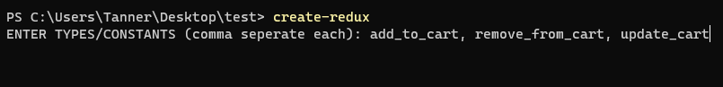

# redux-cli

A simple CLI to easily create a redux base app to get started quicker.

## install the package globally 
`npm i -g @tannerkc/redux-cli`

## run from the root of your react app (outside of src)
`npx create-react-app .`

`create-redux`

all you need to do is enter you constants for the project (you can always add more later):
ENTER TYPES: add_to_cart, remove_from_cart, update_cart